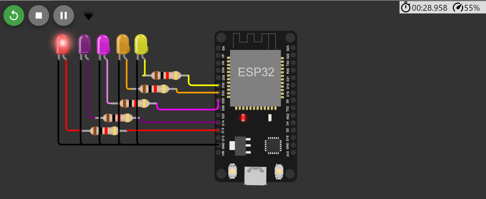
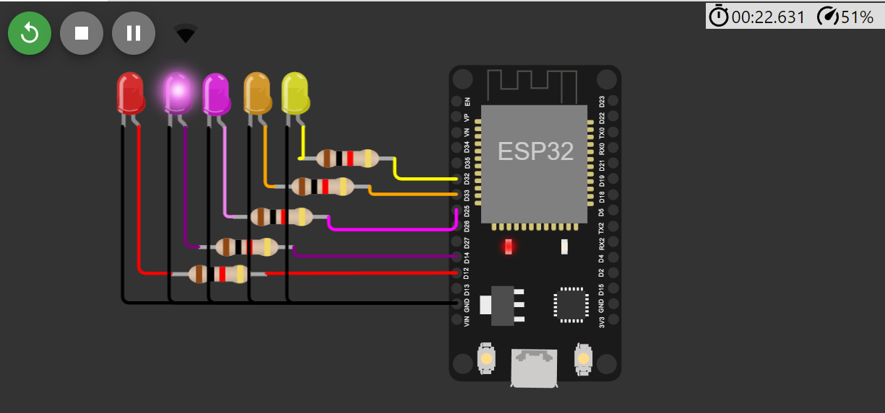

# ESP32_Blink
..............................

# Output:
First " Forward " :

.png)

.png)

Second " Stop " : 

.png)

Third " Left " : 

.png)

Fourth " Right " : 

# Simulations
First " Forward " :
Forward URL:  
                                   
    https://s-m.com.sa/f.html

Forward Full Simulation:
[Forward_Simulation](https://wokwi.com/projects/372624486482800641)

Second " Stop " : 
Stop URL:  
                                   
    https://s-m.com.sa/s.html

Stop Full Simulation:
[Stop_Simulation](https://wokwi.com/projects/372624486482800641)

Third " Left " : 
Left URL:  
                                   
    https://s-m.com.sa/l.html

Left Full Simulation:
[Left_Simulation](https://wokwi.com/projects/372624486482800641)

Fourth " Right " : 
Right URL:  
                                   
    https://s-m.com.sa/r.html

Right Full Simulation:
[Right_Simulation](https://wokwi.com/projects/372625293424965633)

Fifth " Backward " : 
Stop URL:  
                                   
    https://s-m.com.sa/b.html

Stop Full Simulation:
[Stop_Simulation](https://wokwi.com/projects/372625293424965633)
