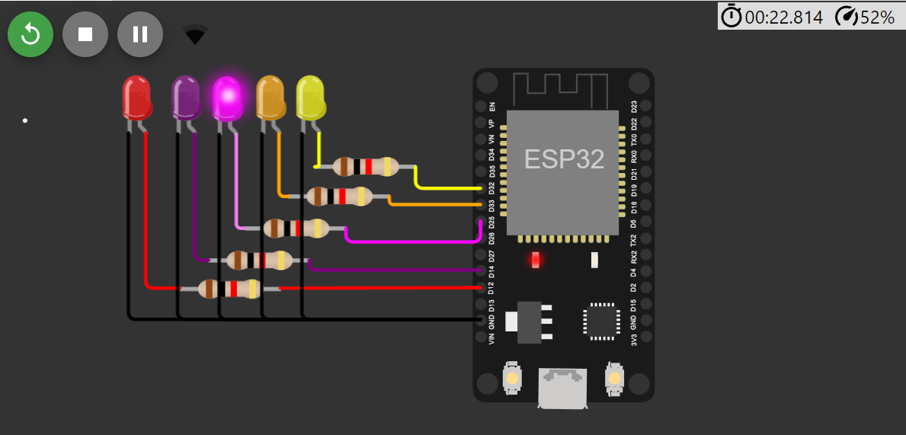
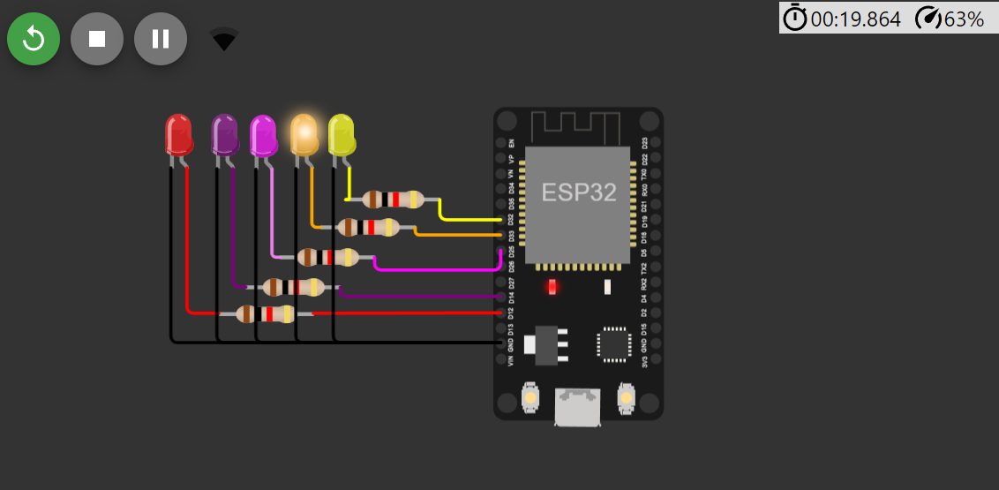

# ESP32_Blink
Simulate the control panel of a robot using ESP32.

# Control panel:
  All instructions for directing the robot's movement are provided on the control panel.

# Control panel components:
1 : Forward 
2 : Stop 
3 : Left 
4 : Right 
5 : Backward
  
# Simulation requirements:

1 : ESP32
2 : LEDs
3 : Resistor
4 : Wires

# Output:
First " Forward " :

.png)

.png)

Second " Stop " : 

.png)

Third " Left " : 

.png)

Fourth " Right " : 

.png)

Fifth " Backward " : 

.png)

# Simulations
First " Forward " :
Forward URL:  
                                   
    https://s-m.com.sa/f.html

Forward Full Simulation:
[Forward_Simulation](https://wokwi.com/projects/372633404070522881)

Second " Stop " : 
Stop URL:  
                                   
    https://s-m.com.sa/s.html

Stop Full Simulation:
[Stop_Simulation](https://wokwi.com/projects/372633660728406017)

Third " Left " : 
Left URL:  
                                   
    https://s-m.com.sa/l.html

Left Full Simulation:
[Left_Simulation](https://wokwi.com/projects/372633789453698049)

Fourth " Right " : 
Right URL:  
                                   
    https://s-m.com.sa/r.html

Right Full Simulation:
[Right_Simulation](https://wokwi.com/projects/372624486482800641)

Fifth " Backward " : 
Backward URL:  
                                   
    https://s-m.com.sa/b.html

Backward Full Simulation:
[Backward_Simulation](https://wokwi.com/projects/372632894691132417)
